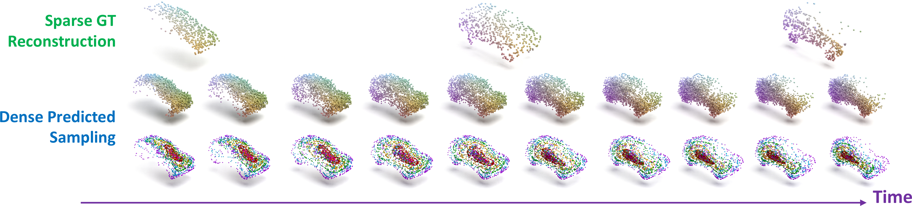

# CaSPR: Learning Canonical Spatiotemporal Point Cloud Representations

This is the official implementation for the NeurIPS 2020 spotlight paper. For more information, see the [project webpage](https://geometry.stanford.edu/projects/caspr/).



## Environment Setup
> Note: the code in this repo has been tested on Ubuntu 16.04 with Python 3.6, CUDA 10.0, and PyTorch 1.4.0. It may work for other setups, but has not been tested.

Make sure CUDA is installed and set up correctly before going forward. Note that CUDA must be >= 10.0 for [Kaolin](https://github.com/NVIDIAGameWorks/kaolin#installation-and-usage)), and the CUDA version must be the same for your PyTorch and Kaolin installations.

First set up and activate a virtual environment with Python 3.6 and install some initial dependencies, e.g. using conda:
* `conda create -n caspr_env python=3.6`
* `conda activate caspr_env`
* `pip install -r requirements.txt`

Next install PyTorch 1.4 compatible with your version of CUDA. For CUDA 10.0 use the following (for other combinations see [this page](https://pytorch.org/get-started/previous-versions/)):
* `pip install torch==1.4.0+cu100 torchvision==0.5.0+cu100 -f https://download.pytorch.org/whl/torch_stable.html`

Next install [tk3dv](https://github.com/drsrinathsridhar/tk3dv), which is used for visualization, and the Neural ODE library [torchdiffeq](https://github.com/rtqichen/torchdiffeq):
* `pip install git+https://github.com/drsrinathsridhar/tk3dv.git`
* `pip install torchdiffeq==0.0.1` (note the version is important)

Next we must build and install [Kaolin](https://github.com/NVIDIAGameWorks/kaolin) which is used for PointNet++:
* `mkdir external`
* `cd external`
* `git clone https://github.com/NVIDIAGameWorks/kaolin.git`
* `cd kaolin`
* `python setup.py build_ext --inplace`
* `python setup.py install` (make sure it uses the expected CUDA and PyTorch installations to build)
* Verify in python with `import kaolin as kal` then `print(kal.__version__)`. If there's an error about "No module names nuscenes" it can be safely ignored.

Finally, to run evaluations we must install the [EMD implementation](https://github.com/daerduoCarey/PyTorchEMD):
* `cd external`
* `git clone https://github.com/daerduoCarey/PyTorchEMD.git`
* `cd PyTorchEMD`
* `python setup.py install`
* `cp build/lib.linux-x86_64-3.6/emd_cuda.cpython-36m-x86_64-linux-gnu.so /home/ubuntu/anaconda3/envs/caspr_env/lib/` (depending on your setup, you will need to change the Python lib path)

## Downloads
### Datasets
The rigid motion (_cars_, _chairs_, and _airplanes_) data and a version of the warping cars dataset are available for download. If you want to experiment with CaSPR without downloading the full datasets, we have also included 3 example car sequences [in the repo](data/demo) that can be used to run the demo detailed below.

Note that this data can be quite large depending on the category, so please edit [`data/download_data.sh`](data/download_data.sh) to only download and unzip what you need. To download all datasets run:
* `cd data`
* `bash download_data.sh`

> Note: The provided warping cars dataset (`warping_cars_full_cat_8k`) is not the exact same as the one used in the paper, but should functionally be no different for training CaSPR. In particular, to make it a reasonable size to host and download, this version of the dataset contains 8k points sampled on the surface of the object at each frame of every sequence (rather than 100k as in the original data used to compare to [OFlow](https://github.com/autonomousvision/occupancy_flow)). The number of points is the only difference between this and the original dataset, the car models and motion sequences used are identical.

Configurations for each dataset that are passed into the training/testing scripts are located in [`data/configs`](data/configs). By default, these should not need to be changed.

### Pretrained Weights
Pretrained models for the full CaSPR pipeline and T-NOCS regression only (TPointNet++) are available for each shape category. To download them run:
* `cd pretrained_weights`
* `bash download_weights.sh`

## Demo
To quickly get started with the example data provided in the repo, run the following command to visualize results of the trained CaSPR car model:
```
python viz.py --data-cfg ../data/configs/demo.cfg --weights ../pretrained_weights/caspr_weights_cars.pth --seq-len 10 --num-pts 2048 --viz-tnocs --viz-observed --viz-interpolated
```

Please read on for an explanation of the visualization.

## Visualization with Pretrained Models
The [`caspr/viz.py`](caspr/viz.py) script is used to visualize predictions from a trained CaSPR model. There are many visualization options that can be toggled with various input flags, for an overview run `python viz.py --help` or look at [`caspr/utils/config_utils.py`](caspr/utils/config_utils.py).

For a given trained model, the viewer iterates through test set sequences and can visualize the resulting T-NOCS regression (`--viz-tnocs`), the reconstruction of observed input steps (`--viz-observed`), and interpolated reconstruction (`--viz-interpolated`). The `--shuffle-test` flag can be used to quickly see a greater variety of visualized models. For a trained rigid car model, first `cd caspr` then run the visualizer with:
```
python viz.py --data-cfg ../data/configs/cars.cfg --weights ../pretrained_weights/caspr_weights_cars.pth --seq-len 10 --num-pts 2048 --shuffle-test --viz-tnocs --viz-observed --viz-interpolated
```

By default, the viewer shows the ground truth points in the green cube, CaSPR predictions in the red cube, and the input sequence outside the cubes in the background. For the observed and interpolated reconstruction visualization, the base Gaussian is also shown. For an explanation of the viewer mouse and keyboard controls, please see the top of [`caspr/utils/pcl_viewer.py`](caspr/utils/pcl_viewer.py).

For the warping cars model, only the reconstructions can be visualized:
```
python viz.py --data-cfg ../data/configs/warping_cars.cfg --weights ../pretrained_weights/caspr_weights_warping_cars.pth --no-regress-tnocs --shuffle-test --seq-len 10 --num-pts 2048 --viz-observed --viz-interpolated
```

## Evaluation with Pretrained Models
The [`caspr/test.py`](caspr/test.py) script is used to run the evaluations (implemented in [`caspr/utils/evaluations.py`](caspr/utils/evaluations.py)) on a trained CaSPR model. Here are examples running various evaluations with the provided pretrained network weights.

### Rigid Motion Data
For this data, all evaluations in the paper were performed on sequences of 10 steps with 2048 points at each step. All examples here are shown for the _car_ data, but work for _chairs_ and _airplanes_ as well. Note that batch size may need to be changed depending on your GPU (all batch sizes below assume a 16GB GPU).

#### Full CaSPR Pipeline
We'll first look at examples evaluating the full CaSPR pipeline model. First `cd caspr`. To run the model on the entire test set while showing a running mean of the same metrics as training time:
```
python test.py --out ../eval_out --data-cfg ../data/configs/cars.cfg --batch-size 2 --weights ../pretrained_weights/caspr_weights_cars.pth --seq-len 10 --num-pts 2048 --log eval_test.txt --eval-test
```

To evaluate errors (CD and EMD) when reconstructing all 10 input timesteps:
```
python test.py --out ../eval_out --data-cfg ../data/configs/cars.cfg --batch-size 16 --weights ../pretrained_weights/caspr_weights_cars.pth --seq-len 10 --num-pts 2048 --log eval_observed.txt --eval-shape-recon-observed
```

Next we evaluate errors (CD and EMD) when using only 3 of the 10 sequence steps as input to the model, and using the remaining 7 to evaluate performance on unobserved reconstruction. This evaluation computes errors both at the 3 observed and 7 unobserved steps:
```
python test.py --out ../eval_out --data-cfg ../data/configs/cars.cfg --batch-size 16 --weights ../pretrained_weights/caspr_weights_cars.pth --seq-len 10 --num-pts 2048 --log eval_unobserved.txt --eval-shape-recon-unobserved
```

Finally, we evaluate just the canonicalization part of the network. This computes errors for the spatial part of the T-NOCS regression (Euclidean distance) and the temporal part (absolute difference).
```
python test.py --out ../eval_out --data-cfg ../data/configs/cars.cfg --batch-size 16 --weights ../pretrained_weights/caspr_weights_cars.pth --seq-len 10 --num-pts 2048 --log eval_tnocs.txt --eval-tnocs-regression
```

#### Canonicalization Network Only
Next, we show how to evaluate the canonicalization network trained by itself instead of within the entire CaSPR pipeline. This is similar to above, but we need to add the `--pretrain-tnocs` flag to indicate we're only using the canonicalization branch of the model, and specify that the latent feature size is 1024 instead of 1600 as in the full model (this is done in the paper to make the number of parameters comparable to baselines).

We evaluate T-NOCS regression with:
```
python test.py --out ../eval_tnocs_out --data-cfg ../data/configs/cars.cfg --batch-size 16 --weights ../pretrained_weights/tnocs_weights_cars.pth --pretrain-tnocs --latent-feat-size 1024 --seq-len 10 --num-pts 2048 --log eval_tnocs.txt --eval-tnocs-regression
```
We can also use this model to perform camera/object pose estimation.
```
python test.py --out ../eval_tnocs_out --data-cfg ../data/configs/cars.cfg --batch-size 16 --weights ../pretrained_weights/tnocs_weights_cars.pth --pretrain-tnocs --latent-feat-size 1024 --seq-len 10 --num-pts 2048 --log eval_pose.txt --eval-pose-observed-ransac --show-pose-viz
```
The `--show-pose-viz` flag is optional and visualizes the estimations. This visualization shows the regressed T-NOCS points in RGB, the GT NOCS points transformed by the predicted pose in blue, the GT input and NOCS point clouds in green, and the GT and predicted camera poses in green and red, respectively.

### Warping Cars Data
Finally, we can evaluate deformable reconstruction performance for the model trained on the warping cars dataset. For this evaluation the `--no-regress-tnocs` flag specifies we do not want to perform canonicalization, since it was trained with only the reconstruction loss:
```
python test.py --out ../eval_deform_out --data-cfg ../data/configs/warping_cars.cfg --batch-size 16 --weights ../pretrained_weights/caspr_weights_warping_cars.pth --no-regress-tnocs --seq-len 10 --num-pts 2048 --log eval_observed.txt --eval-shape-recon-observed
```

## Training
The [`caspr/train.py`](caspr/train.py) script is used to train the full CaSPR pipeline or just the canonicalization network, if desired. By default, training uses sequences of 5 timesteps (randomly subsampled from sequences of length 10) with 1024 points at each timestep. Various hyperparameters of the model and training procedure can be modified with input flags: `cd caspr` then run `python train.py --help` to see these options. Again, the examples here show how to train on the _car_ category, but apply similarly to other object classes. 

To train the full pipeline from scratch:
```
python train.py --data-cfg ../data/configs/cars.cfg --out ../train_cars_out --batch-size 5
```

To train only the canonicalization network:
```
python train.py --data-cfg ../data/configs/cars.cfg --out ../train_cars_tnocs_out --batch-size 8 --pretrain-tnocs
```

To train on the warping cars dataset:
```
python train.py --data-cfg ../data/configs/warping_cars.cfg --out ../train_warping_cars_out --batch-size 5 --no-regress-tnocs
```

To continue training from pretrained weights, simply point to them with the `--weights` flag. You may use the `--parallel` flag to train across all available GPUs in your machine. This takes advantage of the `DataParallel` class in PyTorch which simply splits data across the batch dimension and sends each to a different GPU to perform the forward pass with a copy of the model. So in practice, make sure `--batch-size` is amenable to the number of GPUs you're using. To run training on a specific GPU or a specific set of GPUs, use e.g. `CUDA_VISIBLE_DEVICES=0,2 python train.py ...`. Finally, note that training the full pipeline is slow since it involves solving both the latent ODE and continuous normalizing flow. For the final models in the paper, we trained across 4 16GB GPUs for around 5 days.

## Citation
If you found this code or paper useful, please consider citing:
```
@inproceedings{rempe2020caspr,
	author={Rempe, Davis and Birdal, Tolga and Zhao, Yongheng and Gojcic, Zan and Sridhar, Srinath and Guibas, Leonidas J.},
	title={CaSPR: Learning Canonical Spatiotemporal Point Cloud Representations},
	booktitle={Advances in Neural Information Processing Systems (NeurIPS)},
	year={2020}
}
```

## Questions?
If you run into any problems or have questions, please create an issue or contact Davis (`drempe@stanford.edu`).
